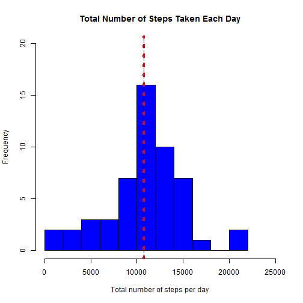
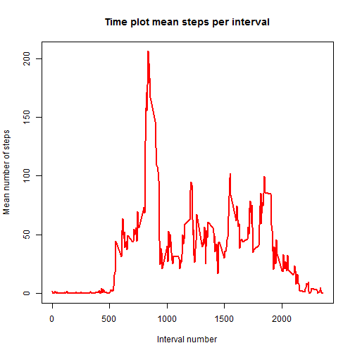
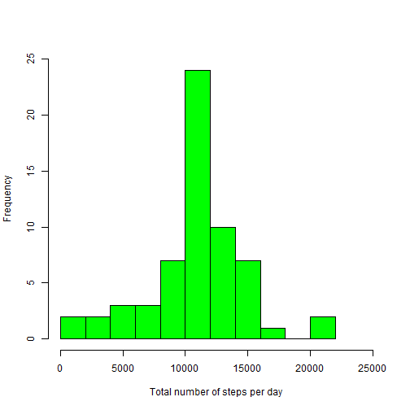
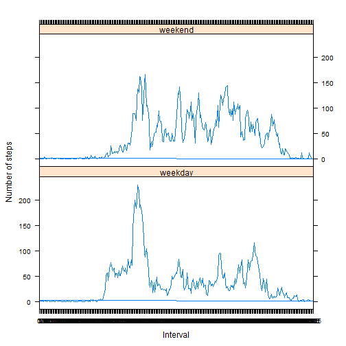

## Introduction

This assignment makes use of data from a personal activity monitoring device. This device collects data at 5 minute intervals through out the day. The data consists of two months of data from an anonymous individual collected during the months of October and November, 2012 and include the number of steps taken in 5 minute intervals each day.

## Data

The variables included in this dataset are:

- steps: Number of steps taking in a 5-minute interval (missing values are coded as NA)

- date: The date on which the measurement was taken in      YYYY-MM-DD format

- interval: Identifier for the 5-minute interval in which measurement was taken
    
## Loading and preprocessing the data

1.  Load the Data

    a.Data should be [downloaded here](https://d396qusza40orc.cloudfront.net/repdata%2Fdata%2Factivity.zip) into activity.zip file
  
    b.Unzip the activity data set and read file **activity.csv**
  
  

```r
url<- "https://d396qusza40orc.cloudfront.net/repdata%2Fdata%2Factivity.zip"
download.file(url, dest="activity.zip", mode="wb") 
unzip ("activity.zip")
activity <- read.csv("activity.csv", header=T, colClasses=c("numeric", "Date", "integer"))
```
2. Process/transform the data (if necessary) into a format suitable for your analysis

```r
activity$interval <- factor(activity$interval) 
x <-nrow(activity)
y<-ncol(activity)
str(activity)
```

```
## 'data.frame':	17568 obs. of  3 variables:
##  $ steps   : num  NA NA NA NA NA NA NA NA NA NA ...
##  $ date    : Date, format: "2012-10-01" "2012-10-01" ...
##  $ interval: Factor w/ 288 levels "0","5","10","15",..: 1 2 3 4 5 6 7 8 9 10 ...
```

```r
head(activity)
```

```
##   steps       date interval
## 1    NA 2012-10-01        0
## 2    NA 2012-10-01        5
## 3    NA 2012-10-01       10
## 4    NA 2012-10-01       15
## 5    NA 2012-10-01       20
## 6    NA 2012-10-01       25
```

```r
z<-dim(activity)[1] - sum(complete.cases(activity))
```
The data frame **activity** has **17568** rows and **3** columns

There are **2304** NA's  

## What is the mean total number of steps taken per day?

```r
 totsteps <- aggregate(steps ~ date, activity, sum, na.rm = TRUE)
 meantotsteps <- round(mean(totsteps$steps),2)
```
Mean total number of steps taken per day: 10766.19


## What is the median total number of steps taken per day?

```r
 medtotsteps <- round(median(totsteps$steps),2)
```
Median total number of steps taken per day: 10765


## Make a histogram of the total number of steps taken each day

```r
hist(totsteps$steps, main = "Total Number of Steps Taken Each Day",  
     xlab = "Total number of steps per day", col = 'blue',
     breaks = 10, ylim = c(0, 20),  xlim = c(0, 25000))
abline(v = meantotsteps, col = "red", lwd = 4, lty = 3)
abline(v = medtotsteps, col = "black", lwd = 1, lty = 5)
```

 

Dotted Red line shows mean

Dashed Black line shows median

## What is the average daily activity pattern?

## Make a time series plot of the 5-minute intervals and the average number of steps taken, averaged across all days

```r
meanintervals <- (tapply(activity$steps, as.factor(activity$interval), mean, na.rm = TRUE))
plot (as.numeric(names(meanintervals)), as.numeric(meanintervals), type = "l", lwd = 2,
      col = "red", main = "Time plot mean steps per interval", xlab = "Interval number",
      ylab = "Mean number of steps")
```

 

## Which 5-minute interval, on average across all the days in the dataset, contains the maximum number of steps?

```r
maxinterval <- meanintervals[meanintervals == max(meanintervals)]
intname <- names(maxinterval)
maxsteps <- round(as.numeric(maxinterval), digits =0)
```
The 5-minute interval with the maximum number of average steps is interval number **835** with **206** steps.


## Imputing missing values

1. Calculate and report the total number of missing values in the dataset (i.e. the total number of rows with NAs)


```r
totnas<-sum(is.na(activity))
```

The total number of rows with NAs is **2304**


2. Devise a strategy for filling in all of the missing values in the dataset. 

-  The total number of missing values was calculated using the original unprocessed dataset and counting the number of rows where the steps has a value = NA.

-  To impute the missing values in the dataset, the following was executed:
  1.  determine which rows have NAs
  2.  create a function to generate values to replace the NAs
  3. Update of the rows where steps=NA with the calculated mean.
  


```r
#determine which rows have NAs
 list <- which( activity$steps %in% NA)
#create a function to generate values to replace the NAs
library(data.table)
```

```
## data.table 1.9.4  For help type: ?data.table
## *** NB: by=.EACHI is now explicit. See README to restore previous behaviour.
```

```r
activity.new<-data.table(activity)
steps_per_day <- activity.new[,list(steps=sum(steps, na.rm=TRUE)),by=date]
mean_over_days <- activity.new[, list(mean = mean(steps, na.rm = TRUE)), by = interval]
imputed_data <- activity.new
na_data <- is.na(imputed_data)
na_intervals <- imputed_data$interval[na_data]
# Create imputed data replacing NAs with 5-minute average
imputed_data[na_data] <- sapply(na_intervals, 
                                function(x) mean_over_days[interval==x,][["mean"]])
```
Check that there are no NA's in imputed_data

```r
sum(is.na(imputed_data))
```

```
## [1] 0
```

```r
head(imputed_data)
```

```
##        steps       date interval
## 1: 1.7169811 2012-10-01        0
## 2: 0.3396226 2012-10-01        5
## 3: 0.1320755 2012-10-01       10
## 4: 0.1509434 2012-10-01       15
## 5: 0.0754717 2012-10-01       20
## 6: 2.0943396 2012-10-01       25
```

 3. Create a new dataset that is equal to the original dataset but with the missing data filled in.

```r
new.activity <- imputed_data
```

4. Make a histogram of the total number of steps taken each day and calculate and report the mean and median total number of steps taken per day. Check if these values differ from the estimates from the first part of the assignment. What is the impact of imputing missing data on the estimates of the total daily number of steps?

    a. Histogram for the new complete data set:
    b. Mean and median total number of steps taken per day for the        new data set:
    

```r
hist(tapply(new.activity$steps, new.activity$date, sum), main = "",
     xlab = "Total number of steps per day", breaks = 10, ylim = c(0, 25), 
     xlim = c(0, 25000), col = "green")
```

 
    
   
    

```r
Total.steps2 <- tapply(new.activity$steps, new.activity$date, sum)
Mean2 <- round(mean(Total.steps2), digits = 0)
Mean2
```

```
## [1] 10766
```

```r
Median2 <- median(Total.steps2)
Median2  
```

```
## [1] 10766.19
```
After imputation there is a slight increase in the median total number of steps taken per day. That is because we imputed a somewhat larger mean value where applicable. No change to the mean total number of steps.


## Are there differences in activity patterns between weekdays and weekends?

 1. Create a new factor variable in the dataset with two levels - "weekday" and "weekend" indicating whether a given date is a weekday or weekend day.

  a. Format the date column and create a new column with names of the days:

```r
new.activity$date <- as.Date(new.activity$date) #format the date column
Days <- weekdays(new.activity$date) # determine the day of the week for each date
new.activity$Day <- Days # create a new column with the names of the days
```

  b.  Create the factor variable:

```r
weekday <- new.activity$Day %in% c("Monday", "Tuesday", "Wednesday", "Thursday", "Friday")
weekend <- new.activity$Day %in% c("Saturday", "Sunday")

new.activity$Day[weekday] <- "weekday"
new.activity$Day[weekend] <- "weekend"

new.activity$Day <- as.factor(new.activity$Day)
str(new.activity)
```

```
## Classes 'data.table' and 'data.frame':	17568 obs. of  4 variables:
##  $ steps   : num  1.717 0.3396 0.1321 0.1509 0.0755 ...
##  $ date    : Date, format: "2012-10-01" "2012-10-01" ...
##  $ interval: Factor w/ 288 levels "0","5","10","15",..: 1 2 3 4 5 6 7 8 9 10 ...
##  $ Day     : Factor w/ 2 levels "weekday","weekend": 1 1 1 1 1 1 1 1 1 1 ...
##  - attr(*, ".internal.selfref")=<externalptr>
```

### 2. Make a panel plot containing a time series plot of the 5-minute intervals and the average number of steps taken, averaged across all weekday days or weekend days. 

  a) Calculate the average number of steps for weekdays or weekend days

```r
WD.Interval.mean <- (tapply(new.activity$steps[new.activity$Day == "weekday"], 
                     as.factor(new.activity$interval[new.activity$Day == "weekday"]), mean))
new.activity$meansteps[new.activity$Day == "weekday"] <- WD.Interval.mean 

WE.Interval.mean <- (tapply(new.activity$steps[new.activity$Day == "weekend"], 
                     as.factor(new.activity$interval[new.activity$Day == "weekend"]), mean))
new.activity$meansteps[new.activity$Day == "weekend"] <- WE.Interval.mean 
```
  b) Panel plot with the average number of steps per interval for weekends and weekdays:

```r
library(lattice)
```

```
## Warning: package 'lattice' was built under R version 3.2.3
```

```r
xyplot(meansteps ~ interval | Day, data = new.activity, type = "l", 
       xlab = "Interval", ylab = "Number of steps", layout = c(1, 2)) 
```

 

### Observations:  
By comparing plots of weekday and weekend data:  
- The peak interval 0835 occurs on weekdays and might be attributed to walking to work or to transport station
- Weekends have more steps than weekdays which might be due to more physical weekend activity rather than desk sitting
